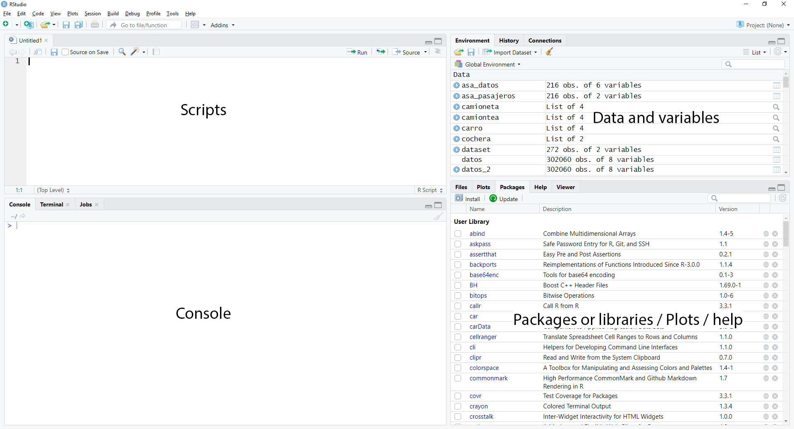
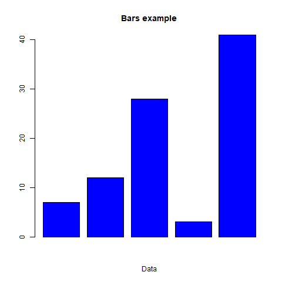
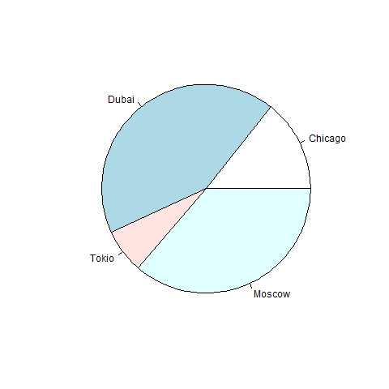
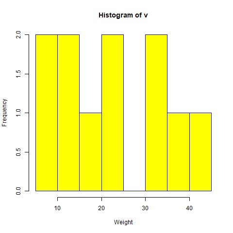
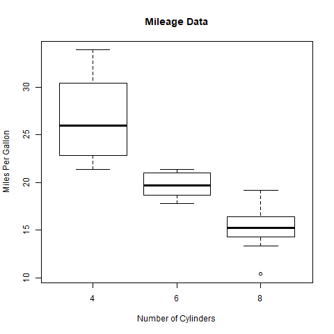

# Intro R / R Intro

[Home / Inicio](https://github.com/TheGlitchCat/probability-and-statistics-R)

## Content / Contenido
- [Environmnet / Entorno](#environmnet--entorno)
- [Adding libs or pkg / Instalar paquetes o librerias](#adding-libs-or-pkg--instalar-paquetes-o-librerias)
- [Easy way to use python into R / La manera facil de usar python en R](#easy-way-to-use-python-into-r--la-manera-facil-de-usar-python-en-r)
- [Help commmand / Comandos de ayuda](#help-commmand--comandos-de-ayuda)
- [R Basics / R Basico](#r-basics--r-basico)
- [PLOT / Graficos](#plot--graficos)


## Environmnet / Entorno


## Adding libs or pkg / Instalar paquetes o librerias
### One / Una
In console / en la consola
```
install.packages("<pkg/lib name>")
```
### Multiple / Varias
```
install.packages(c("<pkg/lib name>", "<pkg/lib name>",...,"<pkg/lib name>"))
```

## Easy way to use python into R / La manera facil de usar python en R
```
install.packages("reticulate")
```

```R
library(reticulate)
py_run_string("
x = 10
y = 11
def sum(x,y):
  return x + y


print(sum(x,y))
")
```

```R
library(reticulate)
py_run_file("script.py")
```

### for more info / para más informacion
- [Link 1 - cran.r-project.org](https://cran.r-project.org/web/packages/reticulate/vignettes/calling_python.html)
- [Link 2 - rstudio-pubs-static.s3.amazonaws.com](http://rstudio-pubs-static.s3.amazonaws.com/407460_396f867ce3494d479fd700960879e22c.html)
- [Link 3 - blog.rstudio.com](https://blog.rstudio.com/2018/03/26/reticulate-r-interface-to-python/)


## Help commmand / Comandos de ayuda 
### Some example  / Algunos ejemplos

```R
?ggplot2 # ?<pkg/lib name>
library(help="ggplot2") #library(help="<pgk/lib name>")
help("read.table")  #help("<pkg/lib name>") 
example("read.table") # example("<pkg/lib name>")
vignette("Intro2Matrix") # vignette("<pkg/lib name>")
```

## R Basics / R Basico
```R
# types / tipos
x <- "a"            #character: "a", "string" / letra o cadena de letras
x <- 2              #numeric: 3, 100.5 / numerico
x <- 3L             #integer: 2L (L makes R store this as an int) / entero
x <- 1+3i           #complex: 1+4i (complex numbers with real and imaginary parts) / complejo
x <- TRUE           #logical: TRUE, FALSE / logico

# vectors / vectores 
vector()            #empty vector / vector vacio
x <- c("a", "b")    #vector with a and b / vector con a y b
character(5)        #empty vector of character / vector vacio de letras
numeric(5)          #empty vector of numeric / vector vacio de numeros
logical(5)          #vector of bool (default=FALSE) / vector vacio de booleanos (por defecto = FALSE)

# secuences / secuencias
x <- 1:10           #secuence from 1 to 10 / secuencia del 1 al 10
x <- seq(from=1, to= 10, by=1) #secuence function from=start to=end by=step by step / funcion de secuencia from=inicio to=fin by=paso a paso

# special values / valores especiales
NaN                 #Not a number / no un numero
Inf                 #infinity / infinito 
```
### for more info / para más información
- [Link 1 - swcarpentry.github.io](https://swcarpentry.github.io/r-novice-inflammation/13-supp-data-structures/#:~:targetText=Key%20Points,%2C%20data%20frame%2C%20and%20factors.)
- [Link 2 - tutorialspoint](https://www.tutorialspoint.com/r/r_data_types.htm)
- [Link 3 - statmethods](https://www.statmethods.net/input/datatypes.html)
- [Link 4 (Español) - cran.r-project.org](https://cran.r-project.org/doc/contrib/rdebuts_es.pdf)


## PLOT / Graficos
- [Tutorial](https://www.tutorialspoint.com/r/r_bar_charts.htm)

### Bars / Barras
```R
H <- c(7,12,28,3,41)
png(file = "barchart.png") 
barplot(H, xlab="Data", main="Bars example", col="blue")
dev.off() #save file
```


### Line / Lineas
```R
v <- c(7,12,28,3,41)
png(file = "line.jpg") 
plot(v,type = "o") # types p=points l=lines o=both / tipos p=puntos l=lineas o=ambos
dev.off() #save file
```


### Pie 
```R
x <- c(21, 62, 10, 53)
labels <- c("Chicago", "Dubai", "Tokio", "Moscow")
png(file = "cites.jpg")
pie(x,labels)
dev.off() #save the file
```


### Histogram / Histograma
```R
v <-  c(9,13,21,8,36,22,12,41,31,33,19)
png(file = "histogram.png")
hist(v,xlab = "Weight",col = "yellow",border = "blue")
dev.off()
```


### Boxplot / Diagrama de cajas
```R
input <- mtcars[,c('mpg','cyl')]
png(file = "boxplot.png")
boxplot(mpg ~ cyl, data = mtcars, xlab = "Number of Cylinders",
        ylab = "Miles Per Gallon", main = "Mileage Data")
dev.off()
```


### Pareto / Diagrama de pareto 
- [Link 1 - Rstudio pubs static](https://rstudio-pubs-static.s3.amazonaws.com/72023_670962b57f444c04999fd1a0a393e113.html)
- [Link 2 - Pareto chart inggplot2](https://nhsrcommunity.com/blog/pareto-chart-in-ggplot2/)