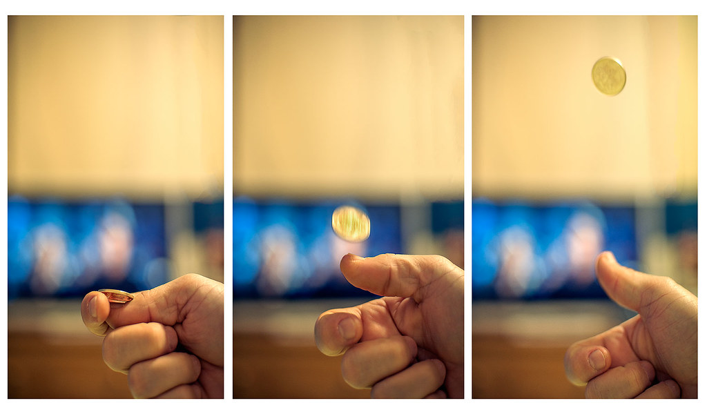

# Classical Probability / Probabilidad Clasica

[Home / Inicio](https://github.com/TheGlitchCat/probability-and-statistics-R)

### English
It is the concept that measures the probability of something happening or an event into a sample space, and each event has equal odds to happen.

### Español
Es el concepto que mide la probabilidad de que algo suceda o un evento en un espacio muestral, y cada evento tiene la misma probabilidad de suceder.

# Sample Space / Espacio Muestral

#### English
A sample space of an experiment is the set of all possible outcomes or results of that experiment.
the common lebels are S, Ω, or U (Universal Set)

#### Español
Un espacio muestral, es el conjunto de posibles resultados de un experimento.
En la literatura se puede encontrar como S, Ω, o U (Conjunto Universal)

#### Example 1 / Ejemplo 1

|   ENGLISH    |                   |    ESPAÑOL   |                   |
|:------------:|:-----------------:|:------------:|:-----------------:|
|     Event    |    Sample Space   |    Evento    |  Espacio muestral |
|Throw a dice  | Ω = {1,2,3,4,5,6} |Lanzar un dado| Ω = {1,2,3,4,5,6} |
|P(1) = amount of 1 in Ω / size of Ω   | P(1) = 1/6  | P(1) = cantidad de 1 en Ω / tamaño de Ω| P(1) = 1/6 |

#### Example 2 / Ejemplo 2

|   ENGLISH    |                   |    ESPAÑOL   |                      |
|:------------:|:-----------------:|:------------:|:--------------------:|
|     Event    |    Sample Space   |    Evento    |   Espacio muestral   | 
|Coin Flipping | Ω = {Head, Tail}  |Lanzar una moneda| Ω = {Cara, Sello} | 
|P(H) = amount of Heads in Ω / size of Ω   | P(H) = 1/2  | P(C) = cantidad de Caras en Ω / tamaño de Ω| P(C) = 1/2 |

