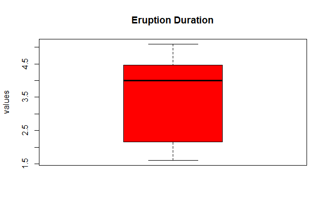
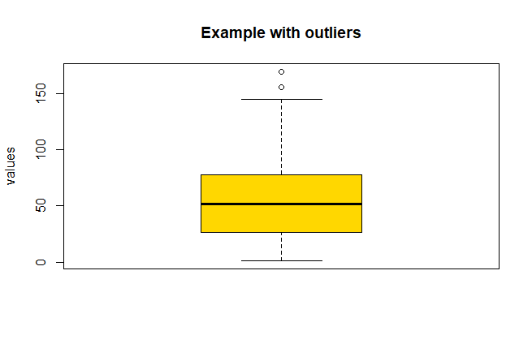

# Boxplot / Diagrama de Caja

[Home / Inicio](https://github.com/TheGlitchCat/probability-and-statistics-R)

#### English
it is a standar representation of the numeric data through their quartiles, min, max and outliers
#### Español
Es una forma estandar de representar la distribución de los datos numericos por medio de sus cuartiles, extremos(mín y máx) y valores atipicos

## Example 1

## Example 2
