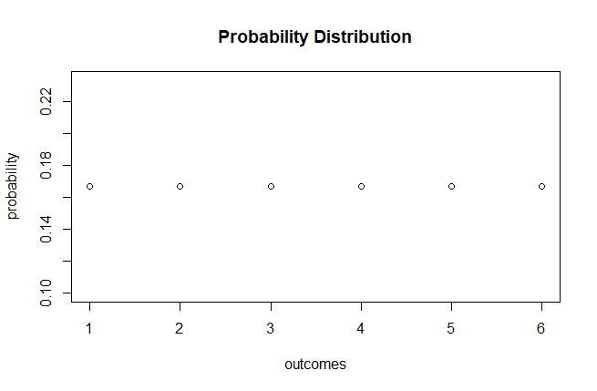
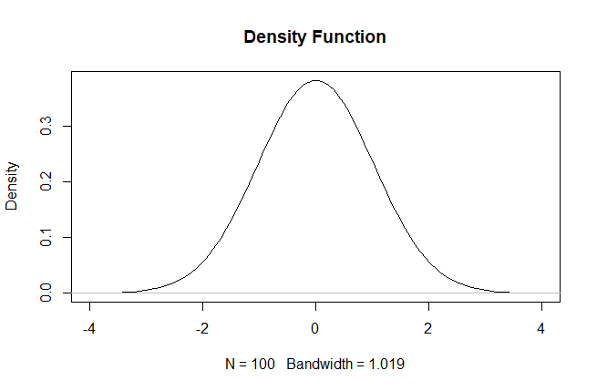
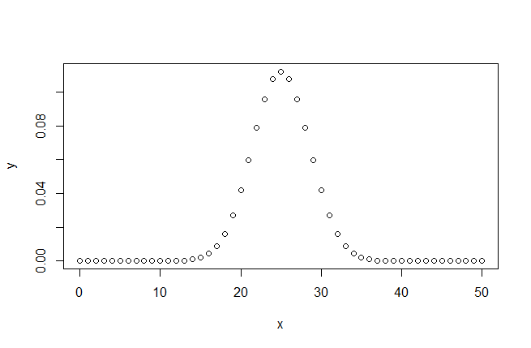

# Random Variable / Variable Aleatoria

[Home / Inicio](https://github.com/TheGlitchCat/probability-and-statistics-R)

## Content / Contenido 
 - [Probability Function (Discrete) / Función de Probabilidad (Discreta)](#probability-function-discrete--funci%c3%b3n-de-probabilidad-discreta)
 - [Probability Distribution / Distribución de Probabilidades](#probability-distribution--distribuci%c3%b3n-de-probabilidades)
 - [Density Function / Función de densidad](#density-function--funci%c3%b3n-de-densidad)
 - [Binomial Distribution / Distribución Binomial](#binomial-distribution--distribuci%c3%b3n-binomial)
 - [Poisson Distribution / Distribución de Poisson](#poisson-distribution--distribuci%c3%b3n-de-poisson)

### English
Are 2 types of random variable:
- Discrete: only values 1,2,3,...
- Continous: any real values between 0 and 1

### Español
Hay 2 tipos de variables aleatorias:
- Discreta: puede tomar valores como 1,2,3,...
- Continuas: puede tomar valores reales entre 0 y 1

## Probability Function (Discrete) / Función de Probabilidad (Discreta)
### English

It is a function that assigns at each point of the sample space X = {𝒙𝟎, 𝒙𝟏,…, 𝒙𝒏} a chance that it will happen.

𝑃(𝑥𝑖)=𝑝𝑖

In which 𝑝𝑖 is the probability of 𝑋= 𝑥𝑖 it will happen.

Taking into account that:

### Español

Es una función que a cada punto del espacio muestral X = {𝒙𝟎, 𝒙𝟏,…, 𝒙𝒏} le asigna una probabilidad de que éste suceda.

𝑃(𝑥𝑖)=𝑝𝑖

En la cual 𝑝𝑖 es la probabilidad de que 𝑋= 𝑥𝑖 suceda.

Teniendo en cuenta que:

## Probability Distribution / Distribución de Probabilidades
### Roll a dice / Lanzar un dado

### English

Probability distribution is the form we can represent the probabilities of an event, and the addition must give always 1 (100%).

### Español 

La distribución de probabilidad es la forma de representar las probabilidades de un evento, y la suma debe dar siempre 1 (100%).

## Density Function / Función de densidad
### English

It is a function that seeks to find the accumulated probability up to a certain value and how it changes at different points.

In which X is a continuous non-negative variable, to which:

### Español

Es una función que busca hallar la probabilidad acumulada hasta cierto valor y como ésta cambia en diferentes puntos.

En la cual X es una variable continua no negativa, a la cual:

## Binomial Distribution / Distribución Binomial

### English
> the binomial distribution with parameters n and p is the discrete probability distribution of the number of successes in a sequence of n independent experiments, each asking a yes–no question, and each with its own boolean-valued outcome: success/yes/true/one (with probability p) or failure/no/false/zero (with probability q = 1 − p). A single success/failure experiment is also called a Bernoulli trial or Bernoulli experiment and a sequence of outcomes is called a Bernoulli process; for a single trial, i.e., n = 1, the binomial distribution is a Bernoulli distribution. The binomial distribution is the basis for the popular binomial test of statistical significance.

> The binomial distribution is frequently used to model the number of successes in a sample of size n drawn with replacement from a population of size N. If the sampling is carried out without replacement, the draws are not independent and so the resulting distribution is a hypergeometric distribution, not a binomial one. However, for N much larger than n, the binomial distribution remains a good approximation, and is widely used. [Wikipedia](https://en.wikipedia.org/wiki/Binomial_distribution)

### Español
> la distribución binomial es una distribución de probabilidad discreta que cuenta el número de éxitos en una secuencia de n ensayos de Bernoulli independientes entre sí, con una probabilidad fija p de ocurrencia del éxito entre los ensayos. Un experimento de Bernoulli se caracteriza por ser dicotómico, esto es, solo dos resultados son posibles. A uno de estos se denomina «éxito» y tiene una probabilidad de ocurrencia p y al otro, «fracaso», con una probabilidad2​ q = 1 - p. En la distribución binomial el anterior experimento se repite n veces, de forma independiente, y se trata de calcular la probabilidad de un determinado número de éxitos. Para n = 1, la binomial se convierte, de hecho, en una distribución de Bernoulli. [Wikipedia](https://es.wikipedia.org/wiki/Distribuci%C3%B3n_binomial)

## Poisson Distribution / Distribución de Poisson

### English
> the Poisson distribution is a discrete probability distribution that expresses the probability of a given number of events occurring in a fixed interval of time or space if these events occur with a known constant rate and independently of the time since the last event.[1] The Poisson distribution can also be used for the number of events in other specified intervals such as distance, area or volume. [Wikipedia](https://en.wikipedia.org/wiki/Poisson_distribution)

### Español
> la distribución de Poisson es una distribución de probabilidad discreta que expresa, a partir de una frecuencia de ocurrencia media, la probabilidad de que ocurra un determinado número de eventos durante cierto período de tiempo. Concretamente, se especializa en la probabilidad de ocurrencia de sucesos con probabilidades muy pequeñas, o sucesos "raros". [Wikipedia](https://es.wikipedia.org/wiki/Distribuci%C3%B3n_de_Poisson)

# References / Referencias
- [Link 1 - discreteRV](https://rpubs.com/jcross/discreteRV)
- [Link 2 - econometrics-with-r](https://www.econometrics-with-r.org/2-1-random-variables-and-probability-distributions.html)
- [Link 3 - rdocumentation.org](https://www.rdocumentation.org/packages/stats/versions/3.6.1/topics/density)