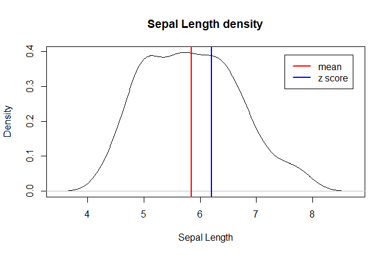

# Z Score / Valor Z

[Home / Inicio](https://github.com/TheGlitchCat/probability-and-statistics-R)

### English
The Z-score is a measure of relative position, for a x, the Z score will describe the position respect to the average in standard deviations units.

A positive Z value (+) indicates that the observed value of x is above the average, otherwise a negative Z value (-) indicates that the observed value of x is below the average.

### Español

El valor Z es una de las medidas de posición relativa, dado un x, el valor Z describe una posición respecto a la media en unidades de desviación estandar.

Un valor Z positivo(+) indica que el valor observado de x esta por encima de la media, por lo contrario un valor Z negativo(-) indica que el valor observado de x esta por debajo de la media.

# Example / Ejemplo

- Dataset = iris$Sepal.length
- x = 6.2 
 

# References / Referencias 
- [Link 1 - stats.seandolinar.com](https://stats.seandolinar.com/calculating-z-scores-with-r/)
- [Link 2 (Español) - support.minitab.com](https://support.minitab.com/es-mx/minitab/18/help-and-how-to/statistics/basic-statistics/supporting-topics/tests-of-means/what-is-a-z-value/#:~:targetText=El%20valor%20Z%20es%20un,desviaci%C3%B3n%20est%C3%A1ndar%20de%201%20cm.)